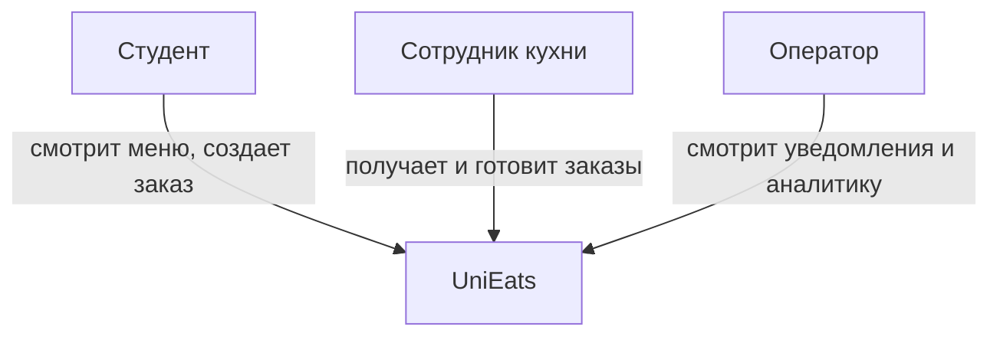
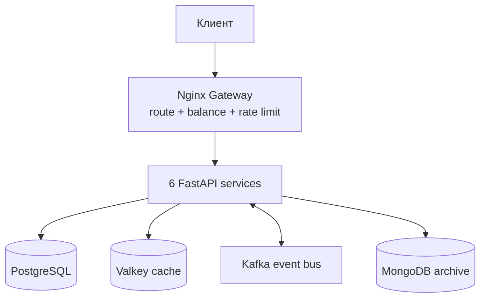
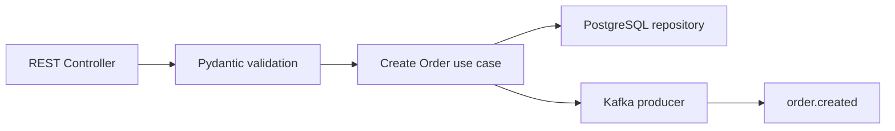
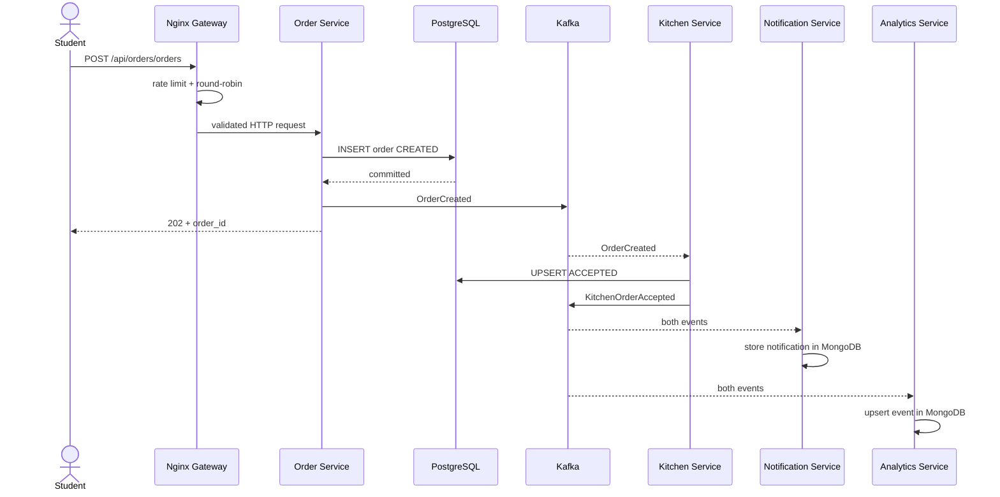
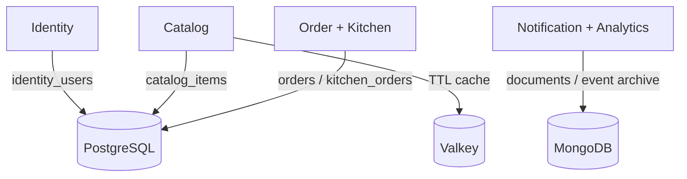

# Архитектура UniEats

Диаграммы написаны на Mermaid и отображаются прямо в GitHub.

## C4 Level 1 — System Context

Граница системы — весь UniEats; внешних платежных/SMS-провайдеров в MVP нет.

## C4 Level 2 — Containers

| Container | Ответственность | Технология |
|---|---|---|
| Gateway | единая точка входа, routing, round-robin, 429 | Nginx |
| Identity | пользователи | FastAPI + PostgreSQL |
| Catalog | меню, cache-aside | FastAPI + PostgreSQL + Valkey |
| Order | прием заказа, producer | FastAPI + PostgreSQL + Kafka |
| Kitchen | обработка заказа, consumer/producer | FastAPI + PostgreSQL + Kafka |
| Notification | журнал уведомлений | FastAPI + Kafka + MongoDB |
| Analytics | архив и счетчики | FastAPI + Kafka + MongoDB |

## C4 Level 3 — компоненты Order Service

Контроллер принимает транспортные данные; Pydantic валидирует; use case координирует сохранение и публикацию; инфраструктурные детали изолированы в `common/infra.py`.

## Sequence Diagram — создание заказа

## Владение данными

На production таблицы следует физически разделить по отдельным базам/схемам и credentials, чтобы один сервис не мог менять данные другого.

## Ключевые компромиссы

- После ответа 202 состояние между сервисами **eventually consistent**, а не мгновенно одинаково.
- Доставка Kafka — at-least-once, поэтому consumers обязаны быть идемпотентными.
- Между `INSERT` и публикацией теоретически возможен сбой; следующий архитектурный шаг — transactional outbox.
- Один Kafka broker подходит для ноутбука, но не дает отказоустойчивости; production требует минимум три brokers и replication factor 3.

