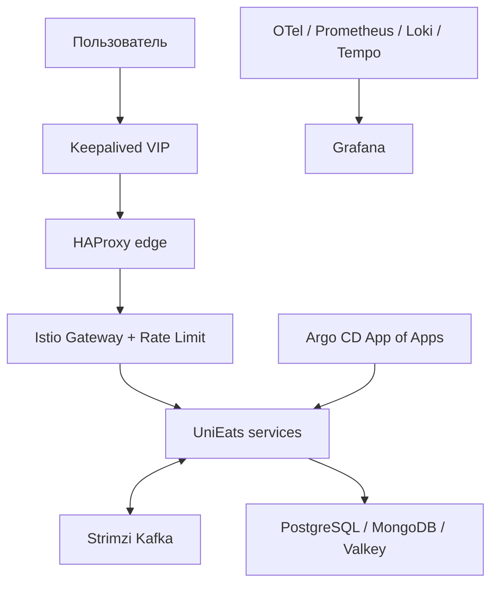

# UniEats Kubernetes Platform

Этот каталог превращает локальный Docker Compose-проект в учебную Kubernetes-платформу.

## Архитектура платформы



## Требования к компьютеру

- Windows 10/11, WSL 2 и Docker Desktop;
- минимум 16 GB RAM, желательно 24 GB для полного observability-профиля;
- `kubectl`, `minikube`, `helm`, `cilium`, `terraform`, `ansible` (Ansible запускается из Ubuntu/WSL).

## Порядок запуска

1. Создать кластер и Cilium:

```powershell
.\platform\scripts\01-bootstrap-cluster.ps1
```

2. Создать namespaces, ServiceAccounts и базовые secrets Terraform-ом:

```powershell
cd platform\terraform
Copy-Item terraform.tfvars.example terraform.tfvars
terraform init
terraform apply
cd ..\..
```

3. Поставить Argo CD и корневое приложение:

```powershell
.\platform\scripts\02-bootstrap-argocd.ps1
```

4. Установить Kafka через Ansible/Strimzi из Ubuntu WSL:

```bash
cd /mnt/d/projects/unieats-starter/unieats/platform/ansible
ansible-galaxy collection install -r requirements.yml
ansible-playbook playbook.yml
```

5. Проверить платформу:

```powershell
.\platform\scripts\03-validate.ps1
```

Подробный порядок и доказательства выполнения заданий находятся в [assignment-report.md](docs/assignment-report.md).

## Важное ограничение node autoscaling

HPA действительно масштабирует pods в Minikube. Karpenter и Cluster Autoscaler создают worker-ноды только через поддерживаемый infrastructure provider (AWS, Azure, GCP или Cluster API). Обычный Minikube не предоставляет такого API. Поэтому:

- локально запускается HPA и демонстрируется дефицит capacity на трёх нодах;
- `autoscaling/karpenter-eks/` содержит cloud-ready NodePool/EC2NodeClass;
- в отчёте явно разделены проверяемый локальный pod autoscaling и настоящий cloud node autoscaling.

Это осознанное ограничение, а не имитация успешного масштабирования нод.

